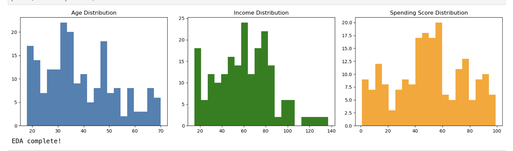
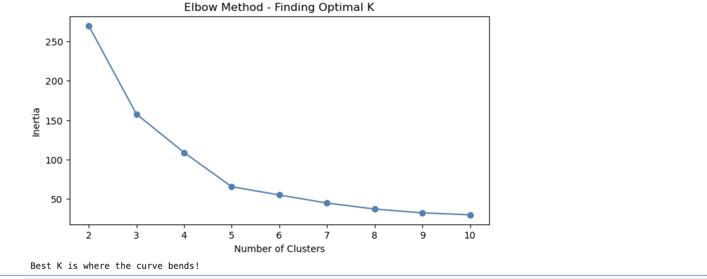
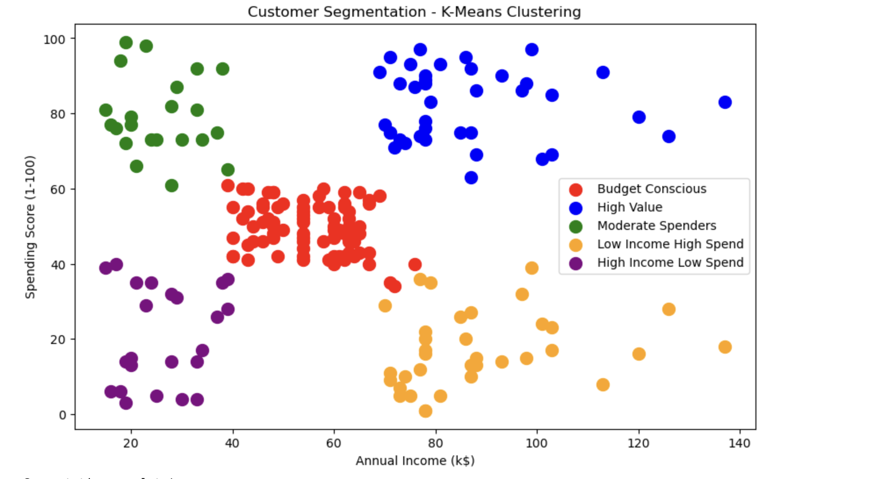

# Customer Segmentation using K-Means Clustering

A machine learning project that uses the **K-Means Clustering** algorithm to segment mall customers based on their **Annual Income** and **Spending Score**. The segmentation helps identify distinct customer groups that can support targeted marketing strategies and improve business decision-making.

---

## Project Overview

Customer segmentation is an unsupervised machine learning technique used to group customers with similar purchasing behavior. In this project, K-Means clustering is applied to identify meaningful customer segments based on income and spending patterns.

---

## Dataset

The **Mall Customers Dataset** contains customer information collected from a shopping mall.

**Features:**

* Customer ID
* Gender
* Age
* Annual Income (k$)
* Spending Score (1–100)

---

## Tools & Technologies

* Python
* Jupyter Notebook
* Pandas
* NumPy
* Matplotlib
* Seaborn
* Scikit-learn

---

## Project Workflow

* Load the dataset
* Perform Exploratory Data Analysis (EDA)
* Visualize feature distributions
* Select Annual Income and Spending Score for clustering
* Standardize the data using StandardScaler
* Determine the optimal number of clusters using the Elbow Method
* Train the K-Means clustering model
* Evaluate clusters using the Silhouette Score
* Visualize customer segments
* Generate business insights

---

## Repository Structure

```text
Customer-Segmentation-KMeans/
│
├── Customer_Segmentation.ipynb
├── Mall_Customers.csv
├── customer_segments.png
├── distributions.png
├── elbow_curve.png
├── segmentation_report.xlsx
└── README.md
```

---

## Results

The K-Means model identified **five customer segments**, including:

* High Value Customers
* Budget Conscious Customers
* Moderate Spenders
* High Income – Low Spending Customers
* Low Income – High Spending Customers

These segments can help businesses:

* Improve targeted marketing campaigns
* Increase customer retention
* Identify premium customers
* Develop personalized offers

---

## Visualizations

### Distribution of Customer Features



### Elbow Method



### Customer Segmentation



---

## Business Insights

* High-income, high-spending customers represent the most valuable customer segment.
* High-income, low-spending customers are potential targets for personalized promotions.
* Low-income, high-spending customers respond well to discounts and promotional offers.
* Segmenting customers enables businesses to make data-driven marketing decisions rather than using a single strategy for all customers.

---

## Future Improvements

* Compare K-Means with Hierarchical Clustering and DBSCAN.
* Apply PCA for cluster visualization.
* Develop an interactive Tableau or Power BI dashboard.
* Deploy the project as a web application using Streamlit.

---

## Author

**Alphie Varghese**

M.Sc. Web & Data Science, Universität Koblenz

**Skills:** Python, SQL, Machine Learning, Data Analysis, Tableau, Power BI, Excel
